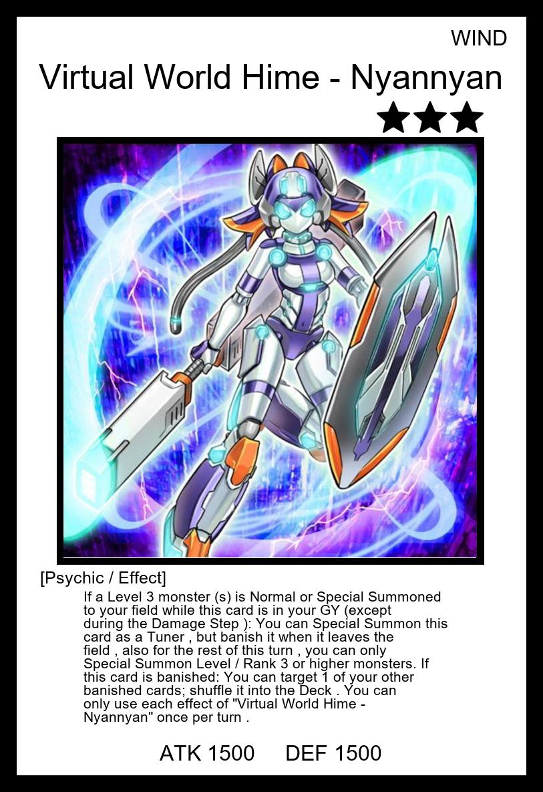
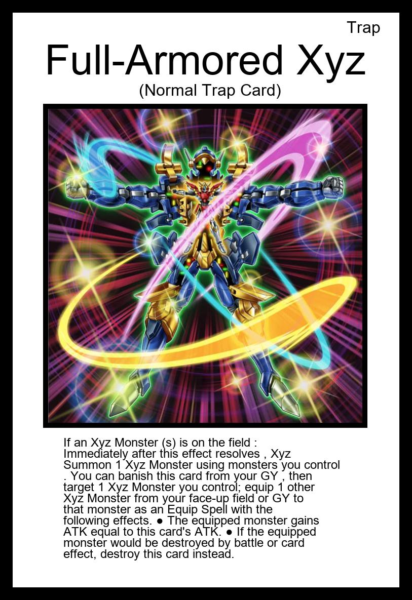
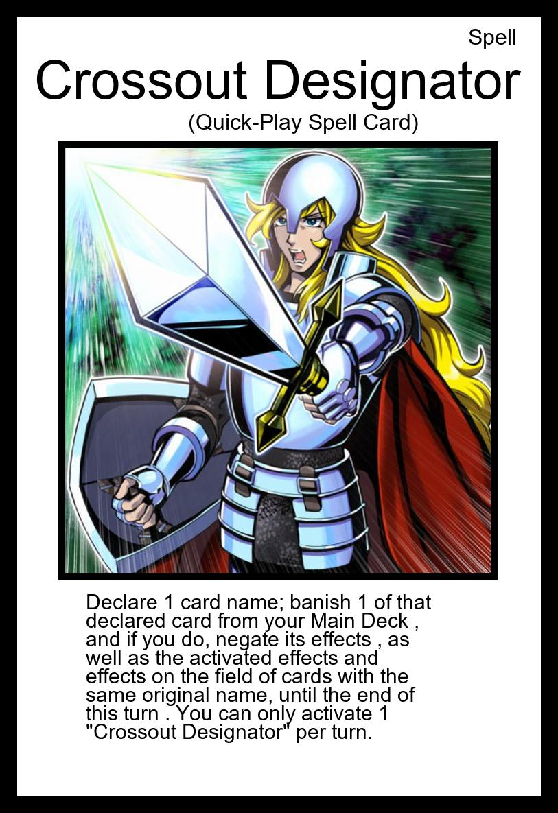

# mangaYgoCards
This program takes in ydk files and makes a pdf of proxies in the style of the ygo manga

* Links don't work
* alt-art cards don't work





The output will look like this [this](writeup/proxies.pdf).

### How to use

**usage: mangaProxies.exe [-h] [-s] ydk_path [image_folder]**

It assumes that the images of the cards to get the card image from is 813 by 1185.
If you use an image for a lower quality image change this function inside of **imagetalker.py**
``` python
def cropImage(card, template):
    # print(f"going into {path}")
    cardImage = path + "/" + card[len(card) - 1] + ".jpg"
    if os.path.isfile(cardImage):       
        sticker = Image.open(cardImage)
    
        # Coordinates: (left, top, right, bottom)
        crop_box = (96, 216, 717, 835) ### this part specifically
        sticker = sticker.crop(crop_box)
        sticker = sticker.resize((620,620))

        # Paste the cropped image onto the destination image at (0, 0)
        template.paste(sticker, (95, 215))
```

