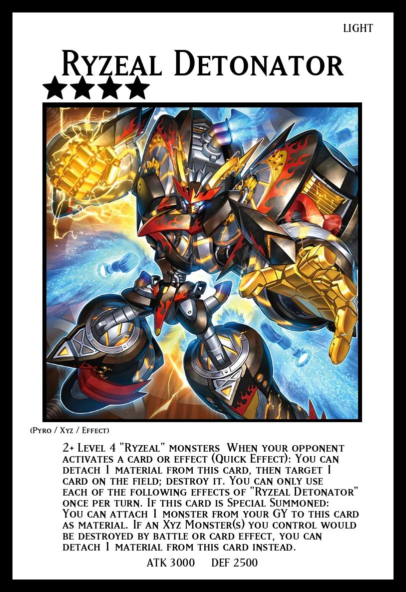
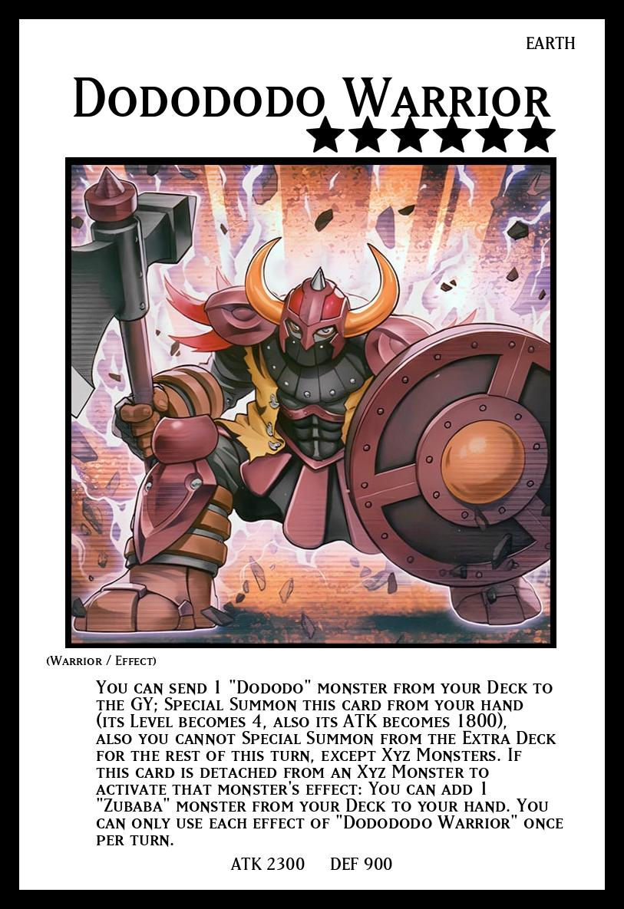
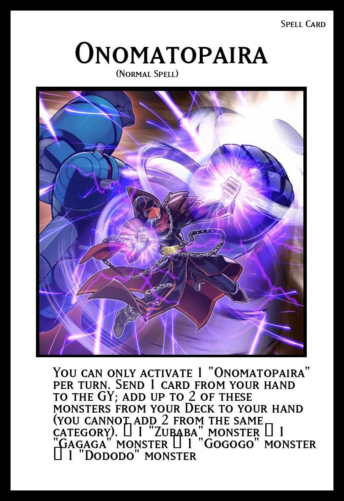
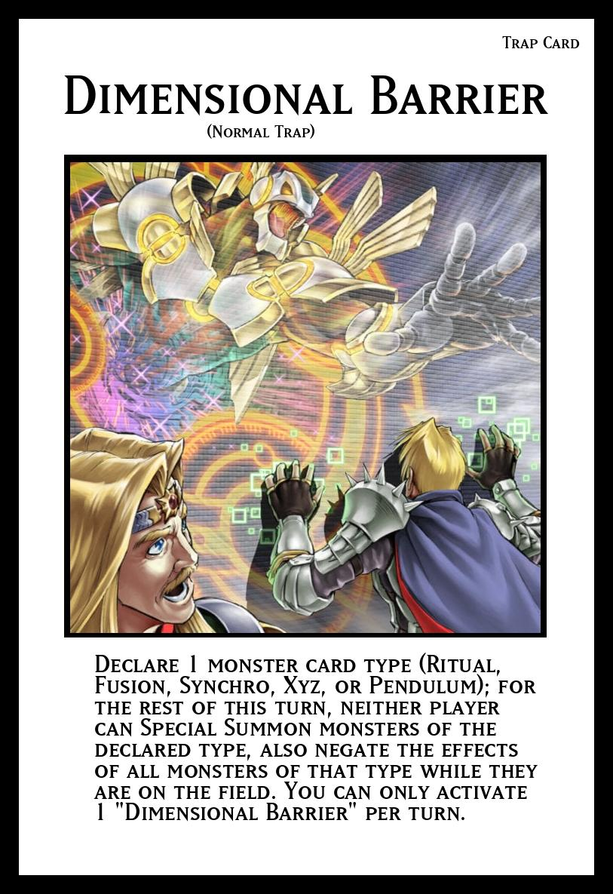

# mangaYgoCards
## Special thanks to the [ygoprodeck api](https://ygoprodeck.com/api-guide/)
This program takes in ydk files and makes a pdf of proxies in the style of the ygo manga

###  Link and Pendulum monsters will not be transformed but will be added to the proxy pdf 

The output will look like this [this](writeup/proxies.pdf).

### How to use

**usage: python main.py [ydk file] [0 if you want to clean up everything or 1 if you want to save the output images]**

